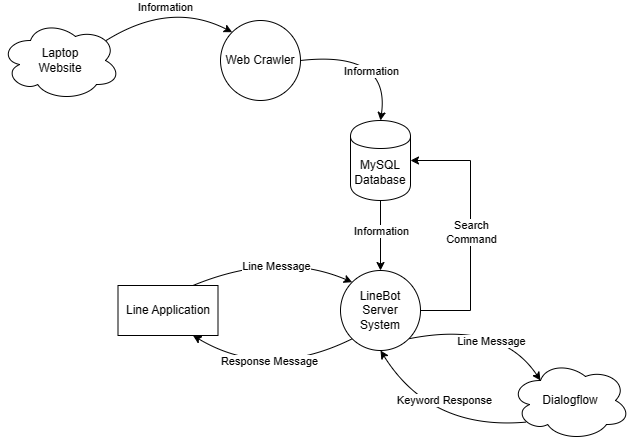
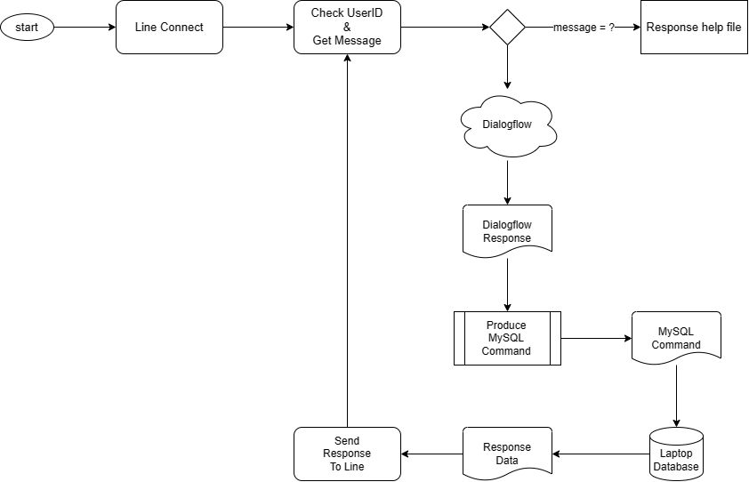

# Line_Chatbot
The project for line chatbot about laptop infomation, using dialogflow, mySQL, and python.

## 程式架構  
    
## 資料流程圖  
    

## Bot Server
> 接收Line訊息傳至Dialogflow進行資訊擷取  
> 從資料庫中獲資料取或執行指令回傳Line訊息  

    
* 環境設定  

| 變數 | 型態 | 意義 |
| ---- | ---- | ---------------  
|line_bot_api       |str  |LINE api-Channel access token  
|handler            |str  |LINE api-Channel secret  
|CLIENT_ACCESS_TOKEN|str  |Dialogflow CLIENT_ACCESS_TOKEN  
|DB                 |class|資料庫資訊_名稱, 使用者, 密碼  

* 主要功能  
> 可以特定資訊進行查詢排序等..

| 功能 | 目的 |
| ---- | ---------------  
|查詢|列出相關的電腦資訊  
|關注|新增或修改關注清單  
|特價|可查詢特價商品  

## 網頁抓取  
!!!時間久遠，無法正常抓取網頁!!!
> 資料庫使用MySQL語法  
* 環境設定  

| 變數 | 型態 | 意義 |
| ---- | ---- | ---------------  
|url    |str  |資訊網址                  
|wants  |list |想要的資訊                 
|DB     |dict |資料庫資訊_名稱, 使用者, 密碼  
